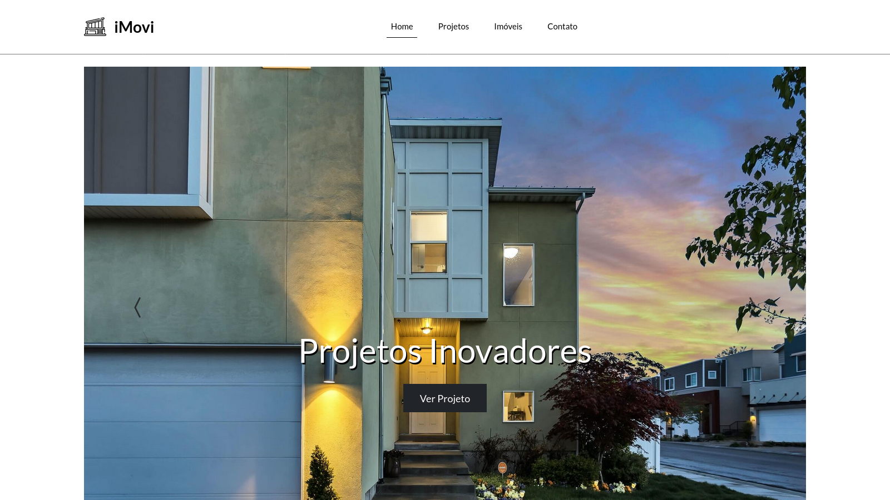
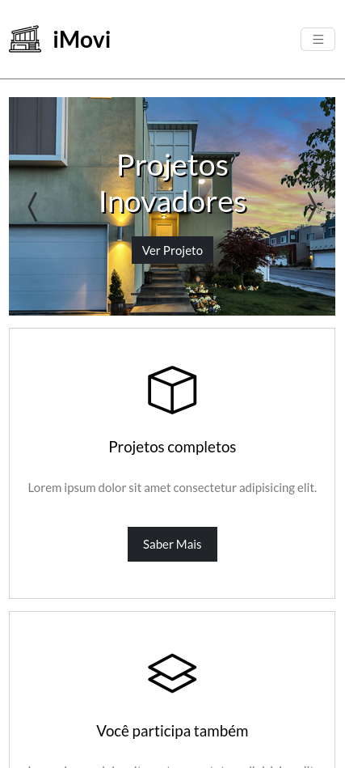
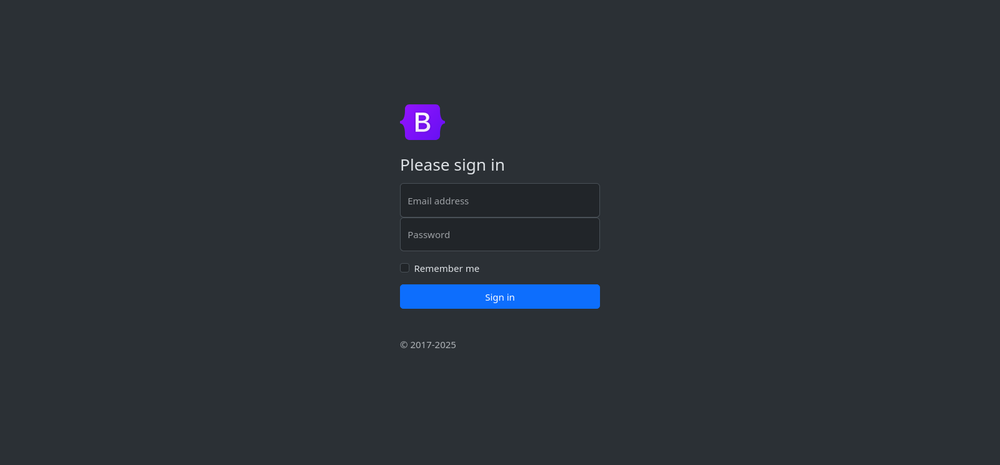
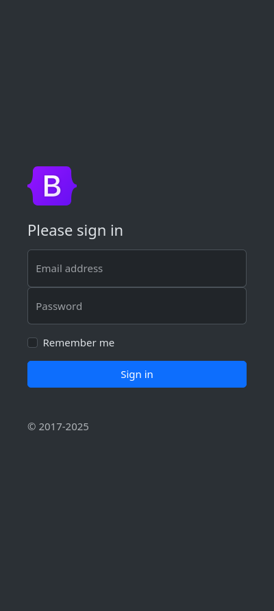

# 🌟 Bootstrap Projects

**Bootstrap Projects** é um repositório dedicado a reunir uma coleção de projetos práticos desenvolvidos utilizando o poderoso framework [Bootstrap](https://getbootstrap.com/). O objetivo principal é demonstrar como aproveitar ao máximo os componentes, utilitários e layouts responsivos que o Bootstrap oferece, além de proporcionar exemplos prontos para uso em uma variedade de cenários.

Este repositório contém desde simples landing pages até projetos mais completos, como portfólios e dashboards, todos com foco em interfaces modernas e responsivas. Ideal tanto para iniciantes que estão aprendendo Bootstrap quanto para desenvolvedores experientes em busca de inspiração e exemplos rápidos.

## 🎯 Objetivos

- Fornecer exemplos claros e concisos de como usar os componentes, utilitários e sistema de grid do Bootstrap.
- Demonstrar as práticas recomendadas para criar layouts responsivos e acessíveis.
- Incentivar a comunidade a contribuir com projetos e compartilhar conhecimento.
- Servir como um recurso de aprendizado para desenvolvedores de todos os níveis de experiência.

## 🧭 Guia de Navegação (Índice)

- [✨ Funcionalidades](#funcionalidades)
- [📁 Estrutura](#estrutura)
- [🛠️ Tecnologias Utilizadas](#tecnologias-utilizadas)
- [🖼️ Screenshots dos Projetos](#screenshots-dos-projetos)
- [Projeto 01: imovi](#projeto-01-imovi)
- [Projeto 02: login-form](#projeto-02-login-form)
- [🚀 Começando](#começando)
- [👤 Sobre o Desenvolvedor](#sobre-o-desenvolvedor)
- [📫 Contribuir](#contribuir)
- [📜 Licença](#licença)

## ✨ Funcionalidades

Este repositório foi projetado para ser uma fonte de aprendizado e inspiração com exemplos práticos, incluindo:

- **Uso Real do Bootstrap 5**: Projetos que implementam de forma prática os novos recursos do Bootstrap 5.
- **Layouts Responsivos**: Soluções de layouts que se adaptam perfeitamente a qualquer dispositivo.
- **Estrutura de Código Organizada**: O código é bem estruturado e comentado, facilitando o entendimento e a reutilização.
- **Reusabilidade e Personalização**: Projetos pensados para fácil customização, permitindo que você os adapte rapidamente às suas necessidades.

## 📁 Estrutura

Cada projeto está localizado em sua própria pasta, contendo os arquivos essenciais, como HTML, CSS e JS, que podem ser executados de forma independente.

- **imovi**
- **login-form**

## 🛠️ Tecnologias Utilizadas

- **HTML5**: Estrutura sólida e semântica para construção de páginas.
- **CSS3**: Estilo e design utilizando os recursos mais recentes da linguagem.
- **Bootstrap 5.3.5**: Framework CSS responsivo e de fácil utilização para desenvolvimento rápido de interfaces.

## 🖼️ Screenshots dos Projetos

### Projeto 01: imovi

<span style="font-size: 1.3rem; font-weight: bold;">Página Principal (Versão Desktop)</span>



_Uma visão geral da página principal adaptada para visualização em dispositivos desktop._

<p align="center">
  <span style="font-size: 1.3rem; font-weight: bold;">Página Principal (Versão Mobile)</span>
</p>

<p align="center">
  
</p>

<p align="center"><em>A página principal adaptada para visualização em dispositivos móveis, com layout otimizado para telas menores.</em></p>

---

### Projeto 02: login-form

<span style="font-size: 1.3rem; font-weight: bold;">Página Principal (Versão Desktop)</span>



_Uma visão geral da página principal adaptada para visualização em dispositivos desktop._

<p align="center">
  <span style="font-size: 1.3rem; font-weight: bold;">Página Principal (Versão Mobile)</span>
</p>

<p align="center">
  
</p>

<p align="center"><em>A página principal adaptada para visualização em dispositivos móveis, com layout otimizado para telas menores.</em></p>

## 🚀 Começando

Para começar a utilizar os projetos deste repositório, siga as etapas abaixo:

1. **Clone o repositório:**

   Clone o repositório para sua máquina local com o comando:

   ```bash
   git clone https://github.com/0nF1REy/bootstrap-projects.git
   ```

2. **Entre no diretório do repositório:**

   Navegue até o diretório do repositório clonado:

   ```bash
   cd bootstrap-projects
   ```

3. **Escolha o projeto desejado:**

   Cada projeto está em seu próprio diretório. Para acessar o projeto **imovi**, por exemplo, entre na pasta correspondente:

   ```bash
   cd imovi
   ```

4. **Abra o arquivo `index.html` no seu navegador:**

   - **No Linux:**
     ```bash
     xdg-open index.html
     ```
   - **No macOS:**
     ```bash
     open index.html
     ```
   - **No Windows:**
     ```bash
     start index.html
     ```

   O arquivo será aberto no seu navegador padrão, permitindo que você veja a página funcionando em tempo real.

## 👤 Sobre o Desenvolvedor

<div align="center">

<table>
  <tr>
    <td align="center">
      <a href="https://github.com/0nF1REy" target="_blank">
        <br>
        <b>Alan Ryan</b>
      </a>
      <p>
        ☕ Peopleware | Tech Enthusiast | Code Slinger ☕<br>
        Apaixonado por código limpo, arquitetura escalável e experiências digitais envolventes.
      </p>
      <p style="font-weight: bold; color: #0077B5;">
        Conecte-se comigo:
      </p>
      <p>
        <a href="https://github.com/0nF1REy" target="_blank">
          
        </a>
        <a href="https://gitlab.com/alanryan619" target="_blank">
          
        </a>
        <a href="https://www.linkedin.com/in/alan-ryan-b115ba228" target="_blank">
          
        </a>
        <a href="mailto:alanryan619@gmail.com" target="_blank">
          
        </a>
      </p>
    </td>
  </tr>
</table>

</div>

## 📫 Contribuir

Se você deseja contribuir com o projeto, siga os seguintes passos:

1. **Faça um fork** do repositório.

2. **Crie uma branch** com a sua funcionalidade:

   ```bash
   git checkout -b feature/minha-funcionalidade
   ```

3. **Faça as alterações necessárias**.

4. **Faça um commit** com suas alterações:

   ```bash
   git commit -m "Adicionado minha funcionalidade"
   ```

5. **Envie para o repositório remoto**:

   ```bash
   git push origin feature/minha-funcionalidade
   ```

6. **Abra um pull request** para a branch `main` do projeto original.

### Documentações úteis

- **<a href="https://www.atlassian.com/br/git/tutorials/making-a-pull-request" target="_blank">📝 Como criar uma solicitação pull</a>**

- **<a href="https://gist.github.com/joshbuchea/6f47e86d2510bce28f8e7f42ae84c716" target="_blank">💾 Padrão de commit</a>**

## 📜 Licença

Este projeto está sob a licença MIT. Consulte o arquivo [LICENSE](LICENSE) para obter mais detalhes.
